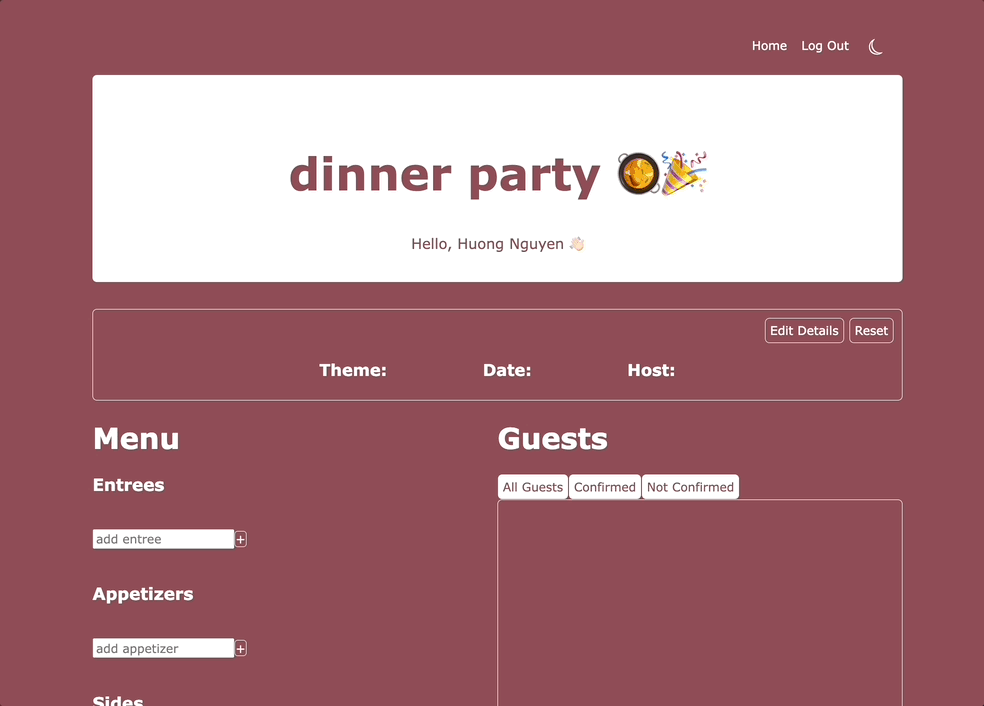

# dinner-party

## Overview
Dinner Party was built for those who love hosting dinner parties and love to plan. In this application, you can log in and see your previous and upcoming parties you're hosting. You can plan out your menu and invite guests, who will see the party invitations when they log in.

## Table of Contents
* [Tech Stack](https://github.com/huongnguyen04/dinner-party/blob/main/README.md#tech-stack)  
* [Description](https://github.com/huongnguyen04/dinner-party/blob/main/README.md#description)  
* [Product Features](https://github.com/huongnguyen04/dinner-party/blob/main/README.md#product-features)  
* [Installation](https://github.com/huongnguyen04/dinner-party/blob/main/README.md#installation)  
* [Roadmap](https://github.com/huongnguyen04/dinner-party/blob/main/README.md#installation)  

## Tech Stack


## Description
This fullstack application was built using the MERN stack. The food data was received from the Edamam Api and stored in a MongoDB database. Authentication is implemented through Auth0. 
Users can log in and create parties, in which they can add their party theme, date, and host. They can plan their entire menu and guest list. The host may start the party from scratch, or choose a theme from a list of cuisines. If they choose a cuisine as a theme, they will get a generated menu with 3 items in each menu category. The host has the ability to add and delete from this menu. 
On the guest list, if the host provides the guest email, the guest can log in to their account and see that they've been invited to the party. Newly added guest will be defaulted to "Not Confirmed" and the host has the ability to toggle between "Confirmed" and "Not Confirmed" by clicking to the left of the guest name. The host can see different views of the guest list: all guests, confirmed, and not confirmed. 
On the user's home screen, both the parties they are hosting and the parties they are invited to are sorted by date.

# Product Features
## Home


## Login authentication with Auth0


## View a party you've created and add to the menu


## View a party you've created and add to the guest list


## Create a new party, choose a cuisine type from the menu, and get a generated menu


## Create a new party, and input your party details


## Installation
From the root directory, run the following commands in your terminal.

1. To install all dependencies

```
npm install
```

2. To run in development: Run webpack in development & the server. Open http://localhost:3005 in your browser
```
npm start
```
```
npm run server
```
3. To build for production: Run webpack in build mode & the server. Open http://localhost:3005 in your browser
 ```
npm run build
```
 ```
npm run server
```

# Roadmap
1. Allow guest to RSVP
2. Allow recipe hyperlink in menu items
