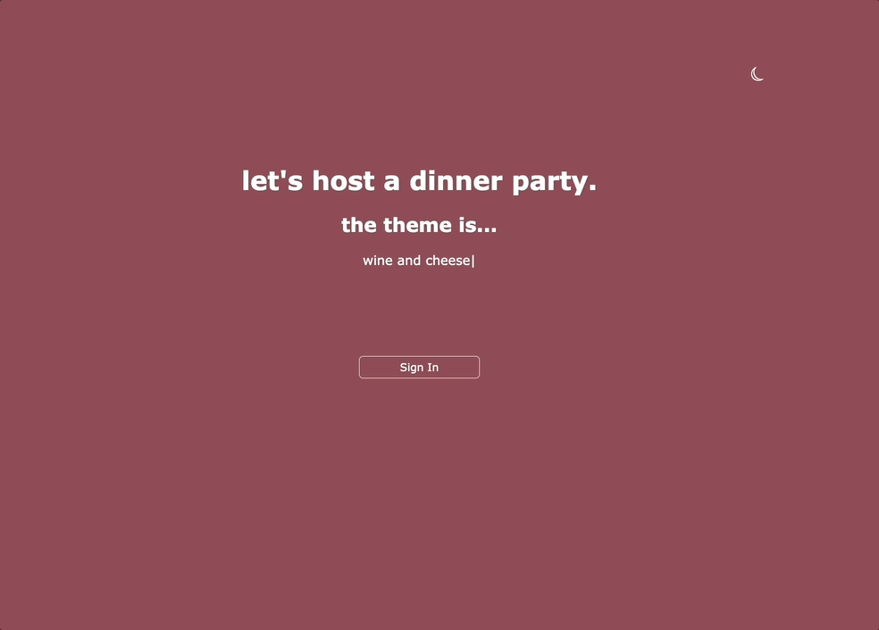
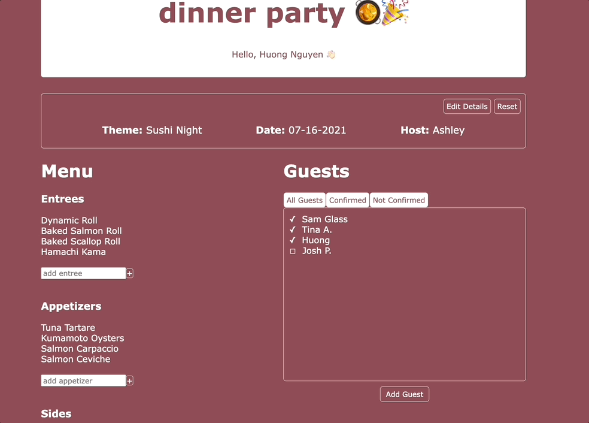
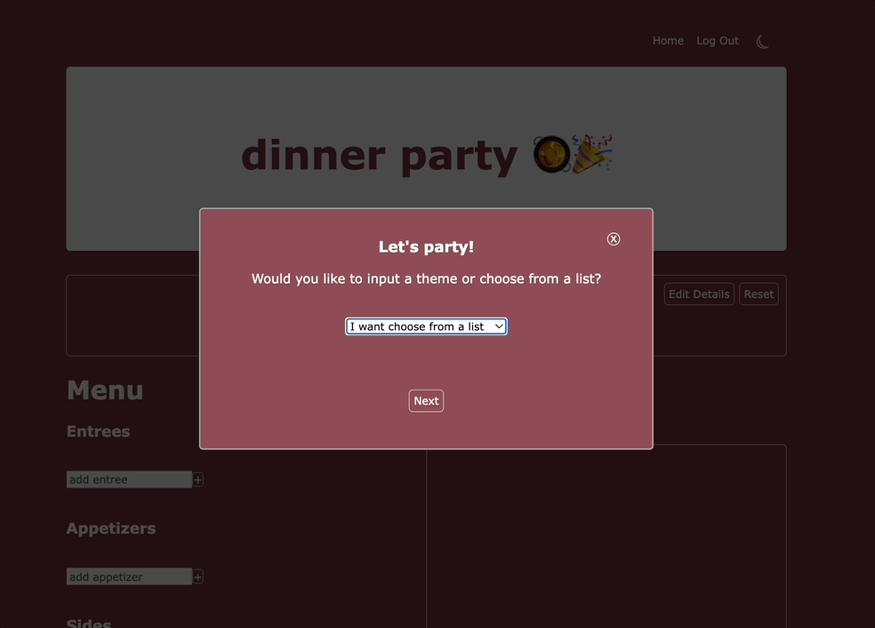

# dinner-party

## Overview
dinner party was built for those who love hosting dinner parties and love to plan. In this application, you can log in and see your previous and upcoming parties you're hosting. You can plan out your menu and invite guests, who will see the party invitations when they log in.

## Table of Contents


## Tech Stack

[MongoDB](https://img.shields.io/badge/MongoDB-%234ea94b.svg?style=for-the-badge&logo=mongodb&logoColor=white)


## Description

# Product Features
## Home


## Login authentication with Auth0


## View a party you've created and add to the menu


## View a party you've created and add to the guest list


## Create a new party, choose a cuisine type from the menu, and get a generated menu


## Create a new party, and input your party details


## Installation
From the root directory, run the following commands in your terminal.

1. To install all dependencies

```
npm install
```

2. Run webpack & the dev server. Open http://localhost:3005 in your browser
```
npm start
```
```
npm run server
```
3. To build for production: Open http://localhost:3005 in your browser
 ```
npm run build
```
 ```
npm run server
```

# Roadmap
1. Allow guest to RSVP
2. Allow recipe hyperlink in menu items
