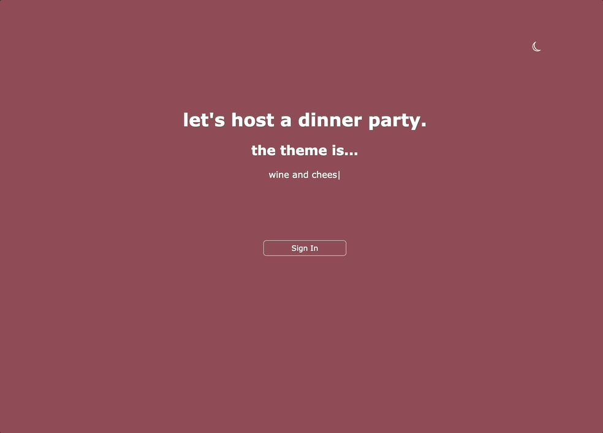

# dinner-party

## Overview
dinner party was built for those who love hosting dinner parties and love to plan. In this application, you can log in and see your previous and upcoming parties you're hosting. You can plan out your menu and invite guests, who will see the party invitations when they log in.

## Table of Contents


## Tech Stack


## Description

## Installation
Use npm and run the following command to download the dependencies.

```
npm install
```

Run both of the following commands:
```
npm start
```

```
npm run server
```

Open localhost:3005 in your browser

# Usage

# Roadmap


# Product Features
## Home


## Login authentication with Auth0


# View a party you've created and add to the menu


# View a party you've created and add to the guest list


# Create a new party, choose a cuisine type from the menu, and get a generated menu


# Create a new party, and input your party details

